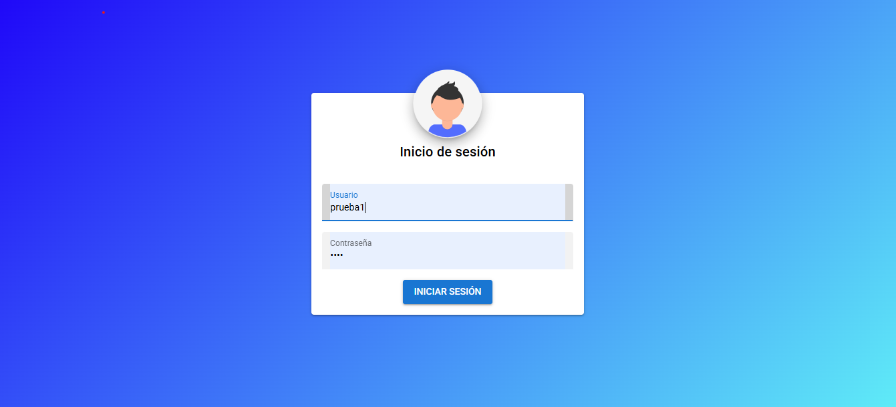
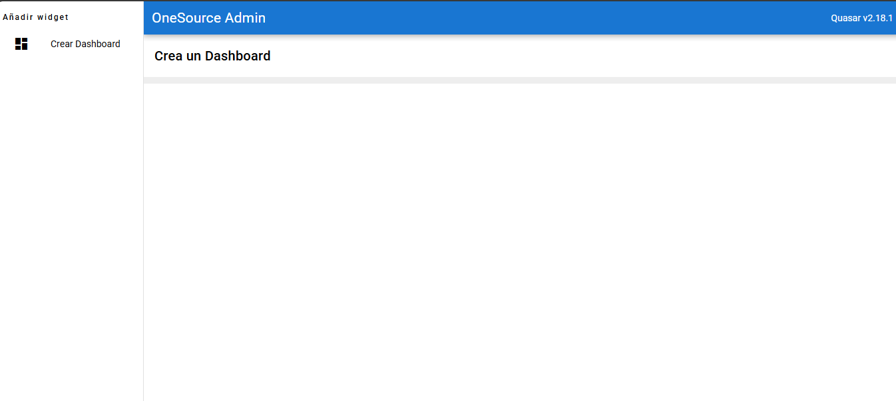
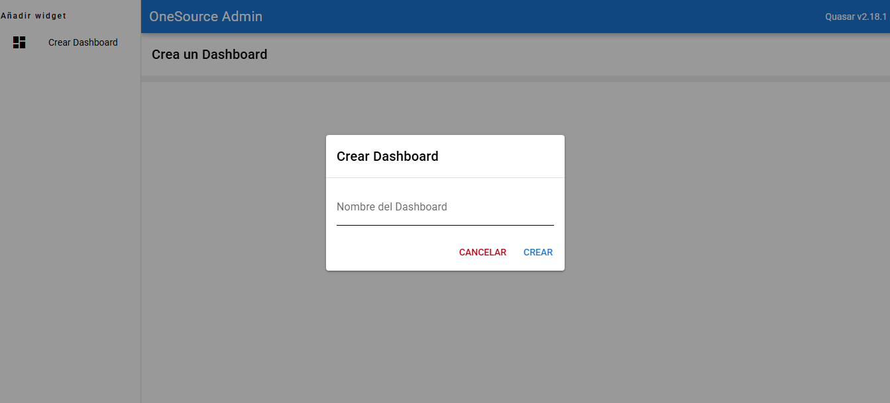
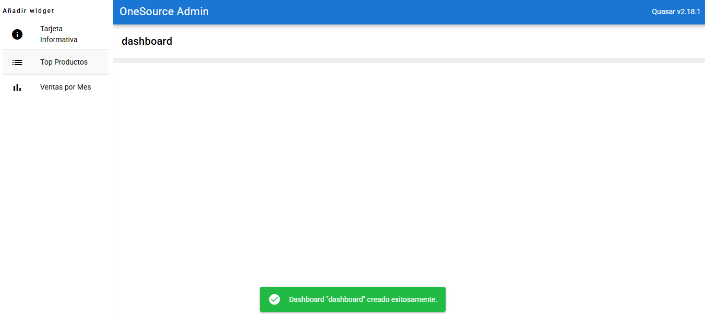
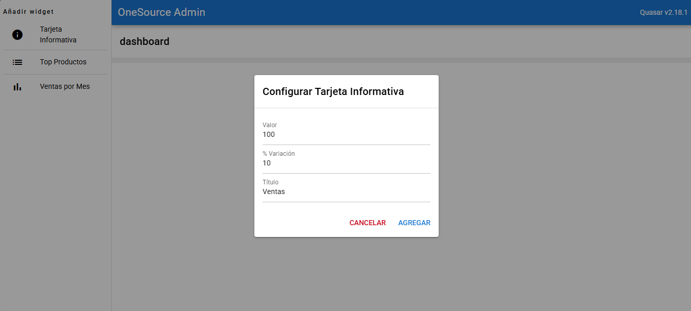
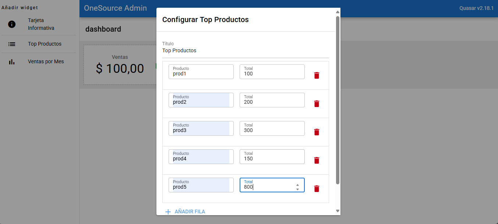
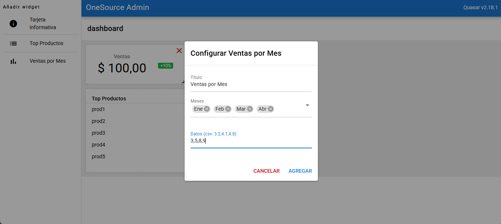
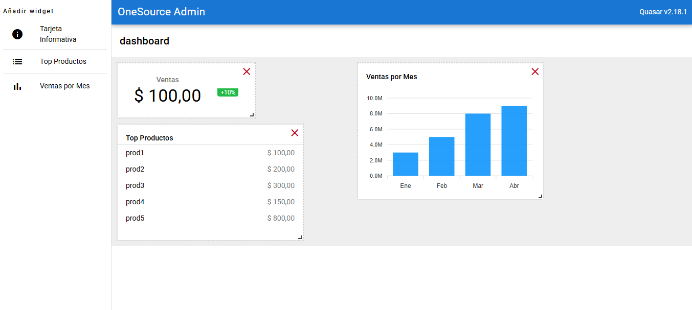
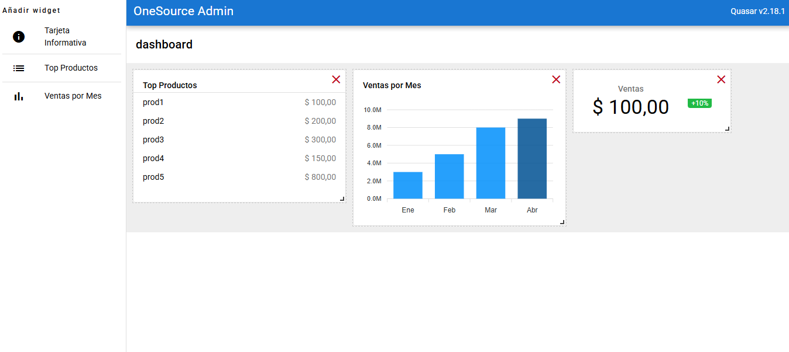

# Proyecto NestJS + Quasar (Vue 3)

Este README describe únicamente los **pasos de instalación** para un proyecto compuesto por un backend NestJS y un frontend Quasar (Vue 3).

---

## Requisitos previos

| Herramienta | Versión recomendada |
|-------------|--------------------|
| **Node.js** | ≥ 18 LTS |
| **npm / pnpm / yarn** | Última estable |
| **Git** | ≥ 2.40 |
| **Nest CLI** | `npm i -g @nestjs/cli` |
| **Quasar CLI** | `npm i -g @quasar/cli` |

> **Opcional:** Docker ≥ 24 si planeas contenedores.

---

## 1 · Clonar el repositorio

```bash
git clone https://github.com/danielbecerrao/oneSource.git
cd oneSource
```

## 2 · Instalación de dependencias

```bash
cd backend
npm install
cd ../frontend
npm install
```

## 3 · Variables de entorno
copia y pega .env.example tanto en el frontend como en el backend y modifica las variables de entorno de acuerdo a su configuración local para la conexión a la base de datos y la url de conexión al backend

## 4 · Ejecución en modo desarrollo
### Backend
```bash
cd backend
npm run start:dev
```
### Frontend
```bash
cd ../frontend
quasar dev
```

## 5 · Compilación para producción
### Backend
```bash
cd backend
npm run build
```

### Frontend
```bash
cd ../frontend
quasar build
```
## 6 · Funcionamiento

Se debe iniciar sesión con el usuario y contraseña que se indica en la ejecución en nube, inicialmente el usuario debe crear su dashboard, segudo puede agregar las cards que considere, existen 3 tipos, tarjeta informativa, top productos, ventas por mes, cada una pedirá la información minima para generar la card.

El dashboard, la card, la información, la posición y el tamaño de la card son almacenados en base de datos.

Es posible eliminar cards del dashboard.

## Ejecución en nube
Se puede usar la aplicación ya que esta desplegada en un servidor, para usarlo debe ingresar a la siguiente url: http://becerra.tplinkdns.com:9000 .
Los usuarios para iniciar sesión son: prueba1, prueba2, prueba3, prueba4 y prueba5 con contraseña 1234

## Imagenes de referencia

### Inicio de sesión



### Dashboard inicial



### Creación de dashboard



### Dashboard creado



### Tarjeta informativa



### Top productos



### Ventas por mes



### Dashboard con cards



### Cambio de posición de cards



